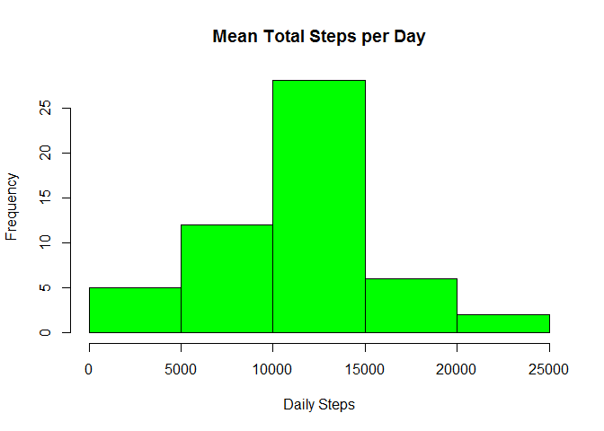
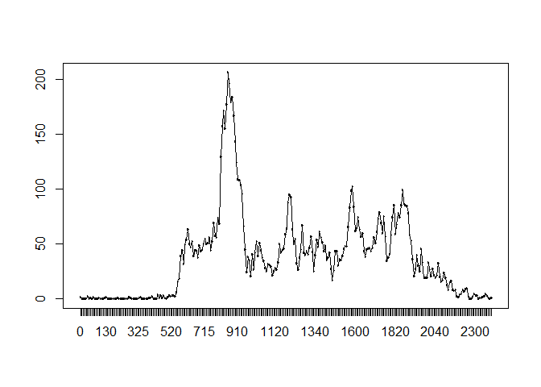
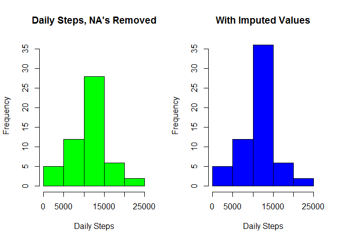
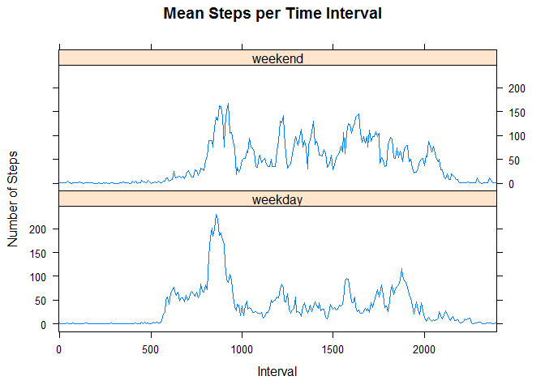
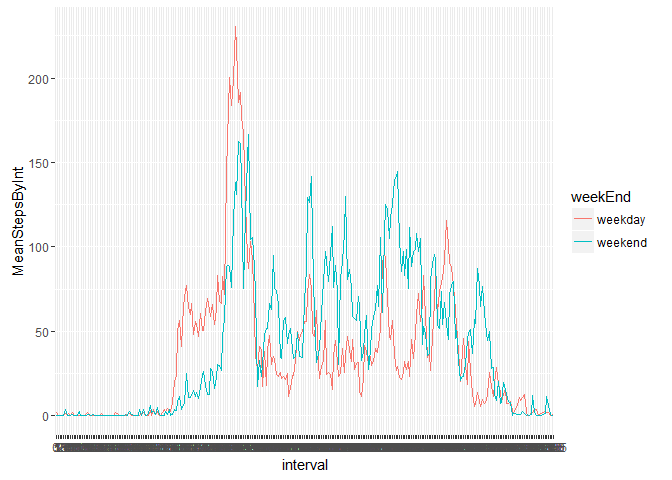
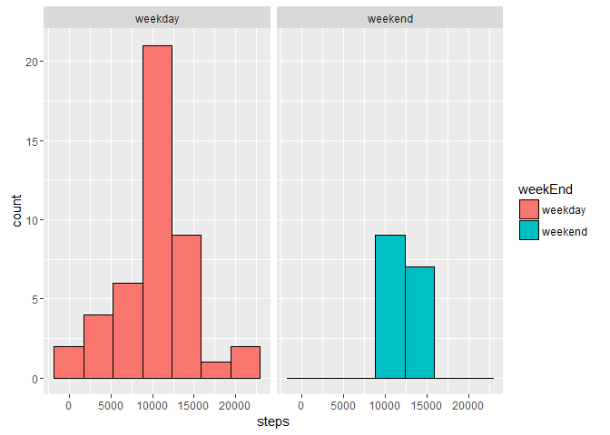
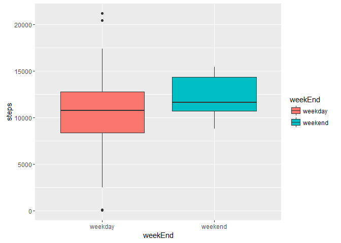

# Reproducible Research: Peer Assessment 1
Thomas Bradford Sprague  
15 September 2016  


## Loading and preprocessing the data
Load the data and packages.


```r
require(dplyr)
```

```
## Loading required package: dplyr
```

```
## 
## Attaching package: 'dplyr'
```

```
## The following objects are masked from 'package:stats':
## 
##     filter, lag
```

```
## The following objects are masked from 'package:base':
## 
##     intersect, setdiff, setequal, union
```

```r
require(ggplot2)
```

```
## Loading required package: ggplot2
```

```r
require(lattice)
```

```
## Loading required package: lattice
```

```r
unzip("activity.zip")
activityDF <- read.csv("activity.csv")
str(activityDF)
```

```
## 'data.frame':	17568 obs. of  3 variables:
##  $ steps   : int  NA NA NA NA NA NA NA NA NA NA ...
##  $ date    : Factor w/ 61 levels "2012-10-01","2012-10-02",..: 1 1 1 1 1 1 1 1 1 1 ...
##  $ interval: int  0 5 10 15 20 25 30 35 40 45 ...
```
### Mark records that have missing values, Convert factor variables 
Create the variable (column) **StepsAreImputed**. For each record, set it equal to TRUE if the number of steps is missing (NA) and FALSE otherwise. This distinguishes measured versus imputed variables later in the analysis.


```r
activityDF <- transform(activityDF, StepsAreImputed=is.na(activityDF$steps))
activityDF$interval <- factor(activityDF$interval)
```

### Create POSIXct time variable 
The **interval** column contains the time in twenty-four hour format. We extract the hour and minute values. Then convert to two-digit text format. Use the resulting string to create a POSIXct date-time variable.


```r
timeString <- as.character(activityDF$interval)
theMinute  <- as.integer(timeString) %% 100
theHour    <- as.character(as.integer(timeString)%/% 100)

theMinute <- sprintf("%02d", theMinute)
theTime   <- paste(theHour, theMinute, sep = ":")

theDateTime    <- paste(activityDF$date, theTime, sep = " ")
POSIX_DateTime <- as.POSIXct(theDateTime)

activityDF <- transform(activityDF, POSIX_DateTime=POSIX_DateTime)

rm(timeString, theMinute, theHour, theTime)
```

## What is the mean total number of steps per day?
We group by date, compute the sum of steps for each date, and then plot the histogram. The mean and median of the daily totals then follows.


```r
trimmedDF <- subset(activityDF, StepsAreImputed == FALSE)
trimmedDF <- group_by(trimmedDF, date)
DailyTotalSteps <- summarize(trimmedDF, DailySteps=sum(steps))
hist(DailyTotalSteps$DailySteps, xlab="Daily Steps", main = "Mean Total Steps per Day", col = "green")
```

<!-- -->

### Mean and Median steps per day

```r
MeanDailyTotalSteps <- mean(DailyTotalSteps$DailySteps)
MedianDailyTotalSteps <- median(DailyTotalSteps$DailySteps)
```

The mean total steps per day is 
10766.19. 
The median of total steps per day is
10765.00.

## What is the average daily activity pattern?
We compute the average number of steps in each time interval and make a time-series plot. Note that missing values are still ignored.


```r
activityDF <- group_by(activityDF, interval)
IntervalMean <- summarize(activityDF, MeanStepsByInt=mean(steps, na.rm = TRUE))
plot(x=IntervalMean$interval, IntervalMean$MeanStepsByInt)
lines(x=IntervalMean$interval, IntervalMean$MeanStepsByInt, type = "l")
```

<!-- -->

### Maximum Average Steps per Interval
We compute the maximum value of the mean steps per interval and then identify the interval that corresponds to that greatest mean value.


```r
print(maxAverageSteps <- max(IntervalMean$MeanStepsByInt))
```

```
## [1] 206.1698
```

```r
print(intervalWithMaxSteps <- which(IntervalMean$MeanStepsByInt==maxAverageSteps))
```

```
## [1] 104
```

```r
elapsedMinutes <- (intervalWithMaxSteps-1) * 5
theHour <- elapsedMinutes %/% 60
theMinutes <- elapsedMinutes %% 60
theTimeOfDay <- paste(as.character(theHour), as.character(theMinutes), sep = ":")
```
Thus, the maximum of the means is 206.17, 
which is achieved in interval 104.

This interval corresponds to the time of day 8:35, which is in twenty-four hour format.

## Imputing missing values
The number and percent of records with missing values follows.


```r
numMissingValues <- sum(is.na(activityDF$steps))
percentMissingValues <- round(100 * sum(is.na(activityDF$steps))/nrow(activityDF), digits = 2)
```

There are 2304 missing values in the **steps** variable, representing 13.11 percent of all records.

### Replace Missing Values by the Interval Mean
Our method for imputing missing values is to determine the mean number of steps for each time interval, then replace each NA by the corresponding mean for its interval. Recall that the data *without* missing values has been extracted and saved in the data frame **trimmedDF**. Thus the requirement to create a new data structure with the missing values filled-in is fulfilled by filling in the missing values in the data frame **activityDF**. In fact, that single data frame contains all information in the pair. Whether the value in **steps** is measured or imputed is recorded in the variable **StepsAreImputed**.

We add a new column to the data frame that contains the average for the time interval represented by each row. That insertion is accomplished with the **dplyr::merge** function. It is then a simple matter to copy this column over any NA values in the **steps** variable. 


```r
activityDF <- merge(activityDF, IntervalMean, by="interval")
activityDF$steps <- ifelse(is.na(activityDF$steps), activityDF$MeanStepsByInt, activityDF$steps)
```

### Histogram of Total Number of Steps per Day
Please see the plots at the end of the next subsection.

### Mean and Median Total Number of Steps per Day
Please read the narrative in subsection, "Effect of Including Imputed Values ..." These values are
reported there, in context.

### Compare Steps per Day With and Without Imputed Values
For convenience o{f comparison, we repeat the histogram of steps per day ignoring missing values, then follow immediately with the histogram obtained by including imputed values.


```r
par(mfrow=c(1,2))
# DailyTotalSteps was previously computed. Data frame with date and steps per day

# Repeat for data frame with imputed values
activityDF <- ungroup(activityDF)
activityDF <- group_by(activityDF, date)
DailyTotalSteps.withImputed <- summarize(activityDF, DailySteps=sum(steps))

# We want common y limits to make histograms easy to compare. The idea for the clever
# coding was found the Stack Overflow article referenced below:
# http://stackoverflow.com/questions/32801380/histogram-counts-change-scale-of-y-axis

# Make histogram object but don't draw it
hist.noImputed  <- hist(DailyTotalSteps$DailySteps, plot=FALSE)
hist.hasImputed <- hist(DailyTotalSteps.withImputed$DailySteps, plot = FALSE)

# Select the max number of elements in a bin over both histograms
maxY <- max(hist.noImputed$counts, hist.hasImputed$counts)

# Now redraw the histograms, but specify the y limits
hist(DailyTotalSteps$DailySteps, xlab="Daily Steps", ylim=c(0, maxY), 
     main="Daily Steps, NA's Removed", col="green")

hist(DailyTotalSteps.withImputed$DailySteps, xlab="Daily Steps", ylim=c(0, maxY), 
     main="With Imputed Values", col="blue")
```

<!-- -->

We see that the histograms have roughly the same shape, but there are more observations in the central bin when imputed values are included. This is not especially surprising. Imputed values are means *over a particular time interval*. Of course, these need not be the same as the mean over *all* time intervals. Never the less, means of any sort are less likely to be extreme values. That is to say, they are less variable and more likely to accumulate near the center of the overall distribution than are individual observations. That virtually all of them fell in the central bin this time was an accident. But accumulating near the overall distribution mean is not; this is the central limit theorem in action.

### Effect of Including Imputed Values on Distribution Mean and Median
We compute the overall distribution mean and median both with and without the imputed values.


```r
meanOfSteps.noImputed <- mean(DailyTotalSteps$DailySteps)
meanOfSteps.withImputed <- mean(DailyTotalSteps.withImputed$DailySteps)
theDifference <- meanOfSteps.withImputed - meanOfSteps.noImputed
```

The **mean number of steps per day**, ignoring missing values is 10766.19. 
If we include the imputed values we obtain an overall mean of 
10766.19, and a computed difference of 
0.000000. 
There is no significant impact on the overall mean number of steps per day.

In this case, the no-effect outcome could not be predicted from knowing the strategy for imputing values alone. However, if it were also known that the distribution of missing values was uniform (or at least symmetric), then this result could be predicted. In other words, if every time interval has the same number of missing values, and each missing value is replaced by the mean for that interval, then there is no change to the overall mean.

If we used the overall mean for all missing values (and we did not), then the no-effect outcome would have been certain.

**Medians** don't work quite the same as means, so we might expect some impact on the median by imputing values. 

```r
MedianDailyTotalSteps.noImputed <- median(DailyTotalSteps$DailySteps)
MedianDailyTotalSteps.withImputed <- median(DailyTotalSteps.withImputed$DailySteps)
theDifference <- MedianDailyTotalSteps.withImputed - MedianDailyTotalSteps.noImputed 
```

If the subdistributions (with respect to time interval) are roughly symmetric, the impact will be small. That is the case here.  

The **median number of total daily steps** without imputed values is 
10765.00. 
**When imputed values are included, the median becomes** 
10766.19.
The computed difference is 
1.188679. 
There is an effect, but it is very small. 

## Differences in activity patterns between weekdays and weekends
We proceed by comparing time-series plots for weekday versus weekend data. 
A new factor variable, **weekend** with two levels: "weekday" and "weekend" facilitates the analysis.


```r
activityDF <- transform(activityDF, 
                weekEnd=factor(ifelse(weekdays(activityDF$POSIX_DateTime) %in% 
                                        c("Monday", "Tuesday", "Wednesday", "Thursday", "Friday"),
                                      "weekday", "weekend")))
activityDF <- ungroup(activityDF)
activityDF <- group_by(activityDF, weekEnd, interval)
IntervalMean <- summarize(activityDF, MeanStepsByInt=mean(steps))

xyplot(MeanStepsByInt~interval | factor(weekEnd), data=IntervalMean, lty=1,
       scales=list(x=list(
         at=seq(1,501,60),
         labels=c("0", "500", "1000", "1500", "2000", "")
       )),
       main="Mean Steps per Time Interval", xlab="Interval",
       ylab="Number of Steps", layout=c(1,2), type="l")
```

<!-- -->

The differences between weekday and weekend distributions will be summarized after the next subsection.

### Additional Analyses
The following were not required for this project, but seem helpful. We begin by repeating the
time series, but this time superimposing the two plots in a single graph.


```r
activityDF <- ungroup(activityDF)
activityDF <- group_by(activityDF, weekEnd, interval)
IntervalMean <- summarize(activityDF, MeanStepsByInt=mean(steps))
p <- ggplot(IntervalMean, aes(x=interval, y=MeanStepsByInt, group=weekEnd, color=weekEnd))
p <- p + geom_line()
print(p)
```

<!-- -->


Next, histograms of daily total steps for weekdays and weekends.

```r
activityDF <- ungroup(activityDF)
activityDF <- group_by(activityDF, weekEnd, date)
DailyTotalSteps.wk.wkEnd <- summarize(activityDF, steps=sum(steps))

p <- ggplot(data=DailyTotalSteps.wk.wkEnd, aes(x=steps, group=weekEnd, fill=weekEnd))
p <- p + geom_histogram(color="black", bins=7)
p <- p + facet_grid(. ~ weekEnd)
print(p)
```

<!-- -->

Finally, boxplots for daily total steps.


```r
p <- ggplot(data=DailyTotalSteps.wk.wkEnd, aes(x=weekEnd, y=steps, fill=weekEnd))
p <- p + geom_boxplot()
print(p)
```

<!-- -->

With these additional plots it is easy to summarize the differences between weekday and weekend distributions of daily total steps and mean steps per time interval.

Starting with mean steps per time interval, we see the step counts growing earlier in the day, generally lower during mid-day, and with a peak late in the day. Weekend values, by contrast, dot fall as deeply mid-day and are sustained later into the evening hours. 

Looking at the histograms and boxplots for total daily steps, we note that the range of values is much broader for weekday data, and all outliers belong to weekdays. On the whole, weekends have higher step counts, probably indicating greater overall physical activity (not just walking).

We do not have data to explain these patterns, but it easy to make a conjecture. Weekend step counts may grow somewhat later in the day if the subject is more likely to sleep later on the weekends. The lower mid-day step counts for week days would be explained if the subject spends most days working at a desk. The late day peak for weekdays could be after work activity (perhaps a walk home?). On weekends, the subject likely engages in recreational activity or, say, works outside of his/her home, and therby maintaining step counts. The extension of the activity later into the evening would be explained by a tendency to not only sleep in later, but also stay up and active later in the evening.

While it is reassuring to have plausible explanations for the observed patterns, it should be emphasized that these remain conjecture without supporting data. 

